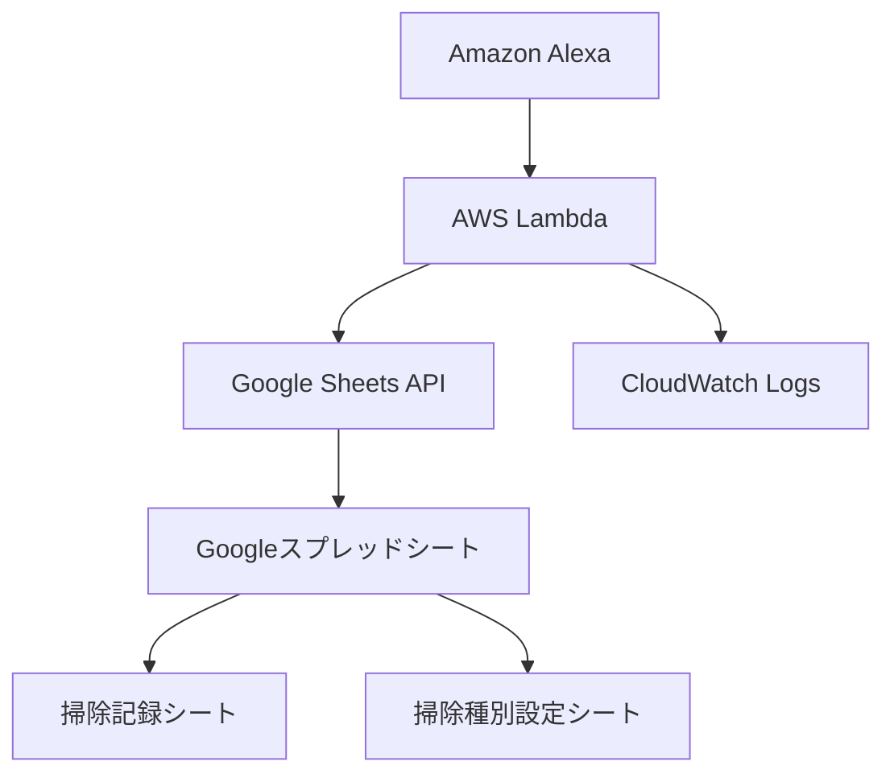

# 🧹 音声ベース掃除記録システム

Amazon Alexa Skills Kitを使用した音声ベース掃除記録システムです。音声で掃除の記録を行い、Googleスプレッドシートに保存、期限切れの掃除を自動でリマインドします。

## ✨ 主な機能

- 🎤 **音声による掃除記録**: 「トイレ掃除をしました」で簡単記録
- 📊 **Googleスプレッドシート連携**: 掃除記録を自動保存・管理
- ⏰ **自動リマインド**: 期限切れの掃除を起動時にお知らせ
- 🎯 **優先度管理**: 掃除の重要度に応じたリマインド順序
- 📱 **Alexa対応**: Amazon Echoシリーズで利用可能

## 🏗️ システム構成



### 技術スタック

- **音声インターフェース**: Amazon Alexa Skills Kit
- **バックエンド**: AWS Lambda (Python 3.9+)
- **データストレージ**: Googleスプレッドシート
- **認証**: Google Cloud Service Account
- **パッケージ管理**: Poetry
- **主要ライブラリ**: 
  - `ask-sdk-core`: Alexa Skills Kit
  - `gspread`: Google Sheets API
  - `google-auth`: Google認証

## 🚀 セットアップ

### 1. 前提条件

- Python 3.9以上
- Poetry
- AWSアカウント
- Google Cloudアカウント
- Amazon Developer Console アカウント

### 2. Google Cloud設定

#### 2.1 プロジェクト作成とAPI有効化

```bash
# Google Cloud Console で以下を実行:
# 1. 新しいプロジェクト作成
# 2. Google Sheets API を有効化
# 3. Google Drive API を有効化
```

#### 2.2 サービスアカウント作成

```bash
# Google Cloud Console で:
# 1. IAM > サービスアカウント > 作成
# 2. 名前: cleaning-management-service
# 3. JSONキーをダウンロード
```

#### 2.3 Googleスプレッドシート準備

1. 新しいスプレッドシートを作成
2. サービスアカウントのメールアドレスに編集権限を付与
3. スプレッドシートIDをメモ（URLの一部）

### 3. AWS設定

#### 3.1 Lambda関数作成

```bash
# AWS Lambda Console で:
# 1. 関数作成: cleaning-management-alexa-skill
# 2. ランタイム: Python 3.9
# 3. 実行ロール: 基本Lambda実行権限
```

#### 3.2 環境変数設定

| 変数名 | 説明 |
|--------|------|
| `GOOGLE_SERVICE_ACCOUNT_KEY` | サービスアカウントのJSONキー（文字列） |
| `GOOGLE_SPREADSHEET_ID` | GoogleスプレッドシートのID |

### 4. Alexaスキル設定

#### 4.1 スキル作成

```json
{
  "name": "CleaningManagementSkill",
  "invocationName": "掃除管理",
  "intents": [
    {
      "name": "RecordCleaningIntent",
      "samples": [
        "{CleaningType}をしました",
        "{CleaningType}を終わりました",
        "{CleaningType}が完了しました"
      ],
      "slots": [
        {
          "name": "CleaningType",
          "type": "CleaningTypes"
        }
      ]
    },
    {
      "name": "CheckCleaningStatusIntent",
      "samples": [
        "掃除の状況を教えて",
        "掃除の状態を確認",
        "何の掃除が必要ですか"
      ]
    }
  ]
}
```

#### 4.2 スロットタイプ定義

**CleaningTypes**:
- トイレ掃除
- 風呂掃除  
- キッチン掃除
- 床掃除
- 窓掃除
- 掃除機かけ

### 5. プロジェクトセットアップ

```bash
# リポジトリクローン
git clone <repository-url>
cd cleaning-management-system

# 依存関係インストール
poetry install

# 環境変数設定
cp .env.example .env
# .envファイルを編集
```

### 6. デプロイ

```bash
# デプロイパッケージ作成
python deploy.py

# AWS Lambda Console で lambda_deployment.zip をアップロード
```

## 📋 使用方法

### 音声コマンド

#### スキル起動
```
「アレクサ、掃除管理を開いて」
```

#### 掃除記録
```
「トイレ掃除をしました」
「風呂掃除を終わりました」
「キッチン掃除が完了しました」
```

#### 状況確認
```
「掃除の状況を教えて」
「何の掃除が必要ですか」
```

#### ヘルプ
```
「ヘルプ」
```

### スプレッドシート構造

#### 掃除記録シート
| 列 | 内容 |
|----|------|
| A | 日時 |
| B | 掃除種別 |
| C | 記録者 |
| D | 備考 |

#### 掃除種別設定シート
| 列 | 内容 |
|----|------|
| A | 掃除種別 |
| B | 推奨頻度（日） |
| C | 最終実施日 |
| D | 次回予定日 |
| E | 優先度 |

## 🔧 開発

### プロジェクト構造

```
cleaning-management-system/
├── src/
│   ├── __init__.py
│   ├── google_sheets_manager.py    # Google Sheets操作
│   └── alexa_handlers.py           # Alexaハンドラー
├── lambda_function.py              # メインLambda関数
├── deploy.py                       # デプロイスクリプト
├── pyproject.toml                  # Poetry設定
├── README.md                       # このファイル
└── archive/                        # 開発過程のファイル
```

### ローカル開発

```bash
# 仮想環境起動
poetry shell

# テスト実行
python lambda_function.py

# コード整形
poetry run black src/ lambda_function.py

# リント
poetry run flake8 src/ lambda_function.py
```

### デバッグ

CloudWatch Logsでログを確認:

```bash
# AWS CLI でログ確認
aws logs filter-log-events \
  --log-group-name /aws/lambda/cleaning-management-alexa-skill \
  --start-time $(date -d '1 hour ago' +%s)000
```

## 📊 掃除種別と設定

| 掃除種別 | 推奨頻度 | 優先度 |
|----------|----------|--------|
| トイレ掃除 | 3日 | 高 |
| 風呂掃除 | 7日 | 高 |
| キッチン掃除 | 3日 | 高 |
| 床掃除 | 7日 | 中 |
| 窓掃除 | 14日 | 低 |
| 掃除機かけ | 3日 | 中 |

## 🔒 セキュリティ

- Google Service Accountキーは環境変数で管理
- AWS Lambda実行ロールは最小権限の原則
- Alexaスキルは認証済みユーザーのみアクセス可能

## 🐛 トラブルシューティング

### よくある問題

#### 1. Google Sheets接続エラー
```
❌ Google Sheets初期化エラー: [Errno -2] Name or service not known
```
**解決策**: 
- 環境変数 `GOOGLE_SERVICE_ACCOUNT_KEY` を確認
- サービスアカウントキーのJSON形式を確認

#### 2. スプレッドシートアクセス権限エラー
```
❌ 403 Forbidden
```
**解決策**:
- サービスアカウントにスプレッドシートの編集権限を付与
- Google Sheets API が有効化されているか確認

#### 3. Alexaスキル応答なし
**解決策**:
- Lambda関数のエンドポイントURLを確認
- CloudWatch Logsでエラーを確認
- スキルの呼び出し名を確認

### ログの見方

```python
# 成功ログ
✅ Google Sheets初期化成功: 掃除管理スプレッドシート
✅ 掃除記録追加成功: トイレ掃除

# エラーログ  
❌ Google Sheets初期化エラー: Invalid credentials
❌ 掃除記録追加エラー: Worksheet not found
```

## 📈 今後の拡張予定

- [ ] 掃除完了時の写真撮影機能
- [ ] 掃除時間の記録
- [ ] 月次・年次レポート生成
- [ ] 複数ユーザー対応
- [ ] モバイルアプリ連携
- [ ] Slack/Discord通知
- [ ] 掃除用品在庫管理

## 🤝 コントリビューション

1. Fork the repository
2. Create your feature branch (`git checkout -b feature/AmazingFeature`)
3. Commit your changes (`git commit -m 'Add some AmazingFeature'`)
4. Push to the branch (`git push origin feature/AmazingFeature`)
5. Open a Pull Request

## 📄 ライセンス

このプロジェクトはMITライセンスの下で公開されています。詳細は [LICENSE](LICENSE) ファイルを参照してください。

## 🙏 謝辞

- Amazon Alexa Skills Kit
- Google Sheets API
- Poetry パッケージマネージャー
- AWS Lambda

---

**開発者**: Cleaning Management System Team  
**最終更新**: 2024年6月22日  
**バージョン**: 1.0.0 